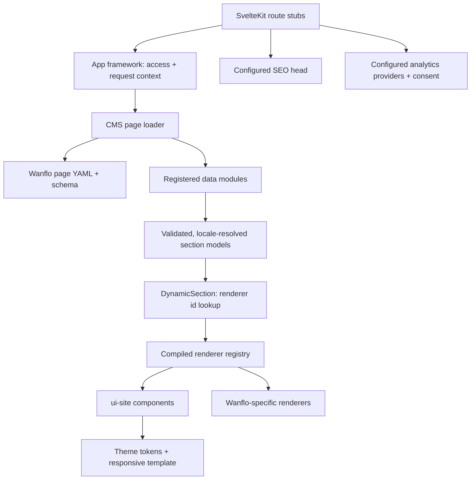

# Wanflo — first Svelte app-framework consumer

**Date:** 2026-10-09
**Status:** Proposed refactoring plan. This document is approved as a planning artifact, not as
authorization to change framework or consumer code. Architecture contracts and each implementation
scope still require explicit user approval.

## Goal and order

Use the copied Wanflo application at `projects/demo/wanflo/` as the first complete consumer of the
Svelte app framework. Wanflo already exercises more production-facing web behavior than Hot Potato:
three locales, public SEO and structured data, consent-gated analytics, theme switching, responsive
navigation, static prerendering, and shared page sections. Extract only what its real pages prove is
reusable, then refactor Hot Potato against the accepted framework pattern. BOS/BR and bootstrap stay
later.

The consumer should own its identity, content schemas/data, page configuration, route composition,
and product-specific behavior. The framework should own shared mechanisms and boilerplate: typed
registration, responsive layout templates, configurable reusable UI components, source resolution,
theme/localization integration, SEO/analytics integrations, and configured access/session services.

This is not a request to replace Wanflo's visuals, content, page order, deployment model, or tracking
policy. It is a plan to preserve those behaviors while separating product data and page composition
from reusable framework facilities.

## Evidence baseline: the copied Wanflo app

The source inventory below comes from `projects/demo/wanflo/src/`, `content/`, and `tests/` in this
worktree. The corresponding reference review is
[`wanflo-svelte-content-localization.md`](../research/wanflo-svelte-content-localization.md).

| Surface | Current behavior to preserve |
|---|---|
| Routes | Home, website, mobile, contacts, and cookies pages. English uses bare paths; Thai and Russian use locale prefixes. All current pages are public. |
| Page composition | Route components explicitly order reusable hero, work, package, FAQ, cross-link, contact, and SEO components. Website and mobile share sections but have distinct page copy and structured data. |
| Layout | The locale layout composes the site header, main content, footer, and optional contact dock. The root layout initializes theme and mounts analytics and cookie-consent behavior. |
| Content | `site.yml`, `packages.yml`, `work.yml`, and per-locale copy YAML are parsed centrally. TypeScript content interfaces describe component-facing data; locale keysets are validated against English. |
| Theme | Light/dark semantic CSS variables drive the page and brand assets. The selected theme persists in local storage and synchronizes across tabs; an inline script avoids a wrong-theme first paint. With no stored preference, the current code renders dark, although comments in `app.css` describe light as the default. Confirm which behavior is intended before migrating it. |
| Localization | English, Thai, and Russian text and routes are supported. Locale is resolved at the route boundary and passed into page components and localized links. |
| SEO | Marketing pages emit canonical and alternate-language URLs, Open Graph/Twitter fields, and JSON-LD. Service pages add Service and FAQ structured data. The cookie-policy page has a canonical URL and `noindex`; sitemap and robots routes are present. |
| Analytics | `app.html` sets Consent Mode v2 denied by default. The mounted analytics component nevertheless loads `gtag.js` whenever a measurement ID exists; Wanflo's tracking wrappers gate page views and conversion events on consent. Accept/decline and withdrawal behavior are covered by browser tests. This is not the same policy as preventing all third-party requests before consent. |
| Responsive behavior | The header switches to a native-details mobile menu below 760px; the footer stacks at that width; the contact dock becomes icon-only below 560px. Sections also own their own responsive grids. |
| Rendering/deployment | The locale layout opts into prerendering. YAML is imported and validated at build time; there is no runtime content server or database. The app uses the Vercel adapter. |

The local dev server at `http://127.0.0.1:5177/` responded with HTTP 200, and Playwright screenshots
were captured for `/` and `/website` at 1440×1000 and 390×844. The captures are temporary review
artifacts, not checked-in goldens. This is only a partial visual baseline: the other pages, tablet
width, locales, and light-theme state still need review. The preview used Node 22.19.0 although the
package declares Node 20.x, so it is not yet a supported-runtime validation. Complete and approve
the baseline before visual changes; do not treat source descriptions alone as proof of page
appearance.

## Proposed responsibility boundaries

### Consumer-owned composition and contracts

- Keep Wanflo's copy, site identity, brand assets, routes, locale choices, page content schemas,
  route-specific metadata, and page ordering in `projects/demo/wanflo/`.
- Declare its page composition in a small consumer-owned configuration: which page/layout is used,
  which sections are placed and in what order, which compiled renderer is selected, and which
  registered data source supplies each renderer's validated model.
- Own each content schema and the values it accepts. The framework can provide schema and
  repository interfaces, but must not impose Wanflo's business vocabulary on other apps.
- Keep ordinary Svelte composition available for page-specific interactions or sections that do not
  benefit from configuration. Do not force every element into a data-driven renderer.

### Framework-owned composition and runtime

- **Responsive layout templates** own only structural layout and responsive behavior: viewport
  breakpoints, columns, gutters, and named content slots. They render caller-provided content and
  do not fetch data, choose page sections, or embed a consumer's header, footer, or brand.
- **Site/page layouts** compose the shared or consumer-selected header, main region, footer, floating
  elements, and page-level responsive template. They do not own the route's business content.
- **Reusable UI components** (for example, header, footer, hero, work list, package cards, FAQ, and
  contact blocks) expose typed input props. Their models are validated before rendering; components
  do not parse YAML, select storage providers, or reach into mutable request-global state.
- **Section resolution** for data-configured placements uses a stable renderer identifier resolved
  through a compiled, application-registered component map. The framework provides a
  `DynamicSection`-like wrapper that resolves the configured section, source, schema, and renderer,
  then provides validated localized data to that renderer. Keep ordinary Svelte composition for
  page-specific interactions or sections that should remain explicit. Content never contains
  import paths or executable component code.
- **Data access** follows the existing schema + read-only repository + immutable app-level registry
  in `platform/svelte/frameworks/app/`. The consumer registers file-backed modules once in its
  composition root; request/session state stays separate and request-scoped. Add repository
  operations only when an actual Wanflo component needs them. Preserve static/build-time loading
  where that is sufficient; do not convert the site to a request-time database or API.
- **Theme and localization** are explicit app services/contracts. Components use semantic theme
  tokens and localized values/keys through typed inputs. Wanflo supplies its token values and locale
  content; framework defaults must not contain Wanflo copy or brand styling.
- **SEO and analytics** are configured capabilities. Public page configuration supplies
  route-specific SEO inputs and structured data; the framework emits the supported metadata.
  Analytics providers are explicitly enabled in app configuration, with provider-specific consent
  requirements and typed events. Wanflo's current GA4 consent semantics are documented and tested
  before any change; a stronger hard gate or optional Vercel provider must be an explicit decision,
  not a silent replacement or a cause of duplicate events.
- **Public/private access and sessions** are declared at the app/page boundary. The framework owns
  request-scoped session context, the auth/session service contract, and route enforcement; the app
  explicitly registers its provider. A private route must fail closed when its required provider is
  not registered. Wanflo's current pages remain public and enable no invented login flow. Implement
  provider-specific sign-in/session behavior only against a concrete protected-page use case.
- **SEO access policy** is tied to route visibility: a private page is non-indexable by default,
  with any exception explicit in app configuration. Preserve Wanflo's existing per-route choices,
  including the cookie-policy page's canonical URL and `noindex`.
- **Request isolation** keeps immutable app registrations separate from request/user state. Static
  content and theme preferences must not become mutable module-global server data.

The current `PageShell`, rail layouts, branding helpers, SEO components, and other Svelte packages
are candidates to inspect during implementation, not automatic extraction targets. Reuse one only
after its existing interface and visual responsibility fit the Wanflo contract.

## Recommended architecture

Use the existing rule from the app-framework/BOS proposals: **code declares capabilities; app-owned
configuration selects only compiled capabilities**. Keep page configuration, content records,
component implementations, and storage access as separate contracts.



### 1. Page, section, and data-source contracts

The proposed app-owned page definition records route policy and composition. It does not contain
component import paths, executable callbacks, CSS, or database queries:

```yaml
# projects/demo/wanflo/content/pages/website.yml
id: website
layout: public-site
access:
  kind: public
seo:
  titleKey: website.meta.title
  descriptionKey: website.meta.description
  canonicalPath: website
  noindex: false
  alternates: true
  jsonLd:
    - wanflo.service
    - wanflo.website-faq
sections:
  - domain: website
    section: hero
    renderer: site.hero
    source: wanflo.page-content
    recordId: website.hero
    required: true
  - domain: website
    section: work
    renderer: wanflo.work-list
    source: wanflo.work-web
    recordId: work
    required: true
  - domain: website
    section: packages
    renderer: wanflo.package-cards
    source: wanflo.packages-web
    recordId: packages
    required: true
  - domain: website
    section: faq
    renderer: site.faq
    source: wanflo.website-faq
    recordId: questions
    required: true
```

The fields `renderer`, `source`, and `jsonLd` are stable IDs. Code registers each ID to a
schema-checked implementation. A config check fails before rendering if an ID is unknown. Neither
YAML nor a database row can supply an import path, SQL, an event callback, or executable code.
Placement order is the order of the `sections` array, so there is no second sort field that can
drift from the visible page order.

The app framework's current read-only data contract is already a usable first repository boundary:

```ts
interface Schema<T> {
  parse(value: unknown): T;
}

interface ReadRepository<T> {
  findById(id: string): Promise<T | null>;
  findMany(): Promise<readonly T[]>;
}

interface DataModule<T> {
  schema: Schema<T>;
  repository: ReadRepository<T>;
}
```

Wanflo registers its YAML-derived modules in its server composition root. Its repository schema
validates `site`, `packages`, `work`, and localized copy records; its app-owned selectors turn
those records into component-specific view models. For example:

```ts
const workModule = {
  schema: WorkProjectSchema,
  repository: createReadOnlyRepository({
    records: workRecords,
    schema: WorkProjectSchema,
    getId: (project) => project.slug
  })
};

const data = createDataRegistry({
  site: siteModule,
  work: workModule,
  packages: packageModule,
  copy: copyModule
});
```

This preserves the schema → repository → registry pattern without pretending that Wanflo has
database CRUD. The first source remains YAML loaded for prerendering. Filtering such as
`workIn('web')`, translation lookup, and `packageCopy()` stays in typed Wanflo selectors until a
second real consumer proves a reusable selector contract is needed. Caching, monitoring, throttling,
and writable repositories are extension points, not initial implementation work.

The CMS page loader resolves the route as follows:

```text
route id + locale
  → enforce PageDefinition.access
  → parse/validate page definition
  → resolve each source ID against the request's DataRegistry
  → apply the registered app-owned selector and locale
  → validate the renderer view model
  → return ordered, serializable ResolvedSection[] + SeoView
```

The loader distinguishes a missing page/record (404), invalid schema/configuration (a build or
server error naming the page and section), denied access (redirect or 403 per policy), and source
failure (an explicit server error). A failed read never becomes an empty successful section.
Required/optional section behavior is explicit in the page schema, not inferred from an empty
array.

### 2. Renderer and component I/O

`@sbx/ui-cms` provides the page/section contracts and a `DynamicSection` host. Each app owns a
compiled renderer registry. A renderer adapter is the typed boundary between generic configuration
and a UI component:

```ts
const rendererRegistry = createRendererRegistry({
  'site.hero': heroRenderer,
  'site.faq': faqRenderer,
  'wanflo.work-list': workListRenderer,
  'wanflo.package-cards': packageCardsRenderer
});
```

Each renderer declares its own schema and accepts a normalized `RenderInput` containing
`{ domain, section, locale, model }`. The source and renderer schemas parse `unknown` at the
serialization boundary; adapters pass only the resulting typed model into the presentational
component. The registry is compiled code, while `renderer` in page YAML is only a lookup key.
Prove this boundary with `svelte-check` and a type-level test before generalizing it: no `any`,
unchecked cast, client import of server modules, or content-selected import path is acceptable.

The presentational I/O boundary is:

| Component | Inputs | Events/outputs | Must not do |
|---|---|---|---|
| `ResponsivePageTemplate` | Children/snippets; responsive width and spacing tokens | Renders the children in the responsive content geometry | Fetch data, select sections, render a site header/footer, or know a domain |
| `SiteLayout` | Header, main, footer, and optional floating-action snippets | Emits semantic header/main/footer structure | Choose page data, storage provider, brand, or route |
| `SiteHeader` | Brand assets/name, ordered nav links, locale links, active route, theme control | Calls typed callbacks for navigation, locale changes, theme changes | Read YAML, infer route data, or emit analytics directly |
| `SiteFooter` | Brand, link groups, contact channels, legal links, copyright/locale strings | Calls typed callbacks for outbound links | Read environment variables or fetch content |
| `HeroSection` | Localized title/body, optional image, ordered typed actions | Calls action callbacks | Resolve translation keys or access the data registry |
| `FaqSection` | Localized heading and ordered `{ question, answer }[]` | Native disclosure interaction; optional typed open event only if required | Choose its data source or invent translation fallbacks |
| `ContactSection` | Localized text plus typed contact-channel models | Calls `contactClick({ channel })` | Embed Wanflo's email/phone/WhatsApp values |
| Wanflo portfolio/package renderers | Wanflo-owned `WorkProject[]`, `Package[]`, locale-resolved copy | Calls typed link/conversion callbacks | Become generic until another app needs the same model |
| `DynamicSection` | A resolved section model and the compiled renderer registry | Renders exactly one registered renderer | Read files, run queries, dynamically import modules, or silently omit failures |

The existing Wanflo `WorkList`, `PackageCards`, `StepLine`, and `TechRow` carry Wanflo-specific
portfolio/package concepts. They remain consumer renderer implementations initially. They can use
generic `ui-site` primitives, but their models do not move into a shared package merely because the
Svelte files look reusable.

### 3. Layouts are two separate layers

The responsive template is geometry only. `@sbx/core-ui` already has snippet-based `PageShell` and
`RailsContentLayout` prior art; implementation first checks whether their current CSS contract
satisfies this simpler public-site need. If not, add `ResponsivePageTemplate.svelte` under
`components/layouts/` and export it there.

```svelte
<!-- A responsive template: it wraps arbitrary caller content and owns only geometry. -->
<ResponsivePageTemplate>
  {#snippet children()}
    <section>Caller-provided page content</section>
  {/snippet}
</ResponsivePageTemplate>
```

The site layout composes the semantic header/footer and page content separately:

```svelte
<SiteLayout>
  {#snippet header()}
    <SiteHeader model={data.shell.header} onLocaleChange={changeLocale} />
  {/snippet}
  {#snippet children()}
    <ResponsivePageTemplate>
      {#snippet children()}
        {#each data.page.sections as section (section.domain + ':' + section.section)}
          <DynamicSection {section} renderers={rendererRegistry} />
        {/each}
      {/snippet}
    </ResponsivePageTemplate>
  {/snippet}
  {#snippet footer()}
    <SiteFooter model={data.shell.footer} />
  {/snippet}
</SiteLayout>
```

The sample illustrates the responsibility split, not a final prop signature. The page config orders
sections; the registered layout composes shell components; the responsive template controls only
breakpoints and geometry; the renderer component owns only its visual/content contract.

### 4. App configuration: visibility, SEO, analytics, theme, and sessions

The recommended consumer configuration is a typed TypeScript composition root, because provider
implementations and renderer components are compiled code. Human-edited page placement and content
remain YAML. Public and server-only settings are distinct so credentials/session providers cannot
be serialized into page data.

```ts
// projects/demo/wanflo/src/lib/app.config.ts — illustrative target API
export const appConfig = defineAppConfig({
  rendering: { mode: 'prerender' },
  site: {
    canonicalOrigin: site.url,
    locales: { default: 'en', supported: ['en', 'th', 'ru'] }
  },
  theme: {
    defaultMode: 'dark', // confirm against the captured no-preference behavior
    storageKey: 'wanflo-theme',
    brand: wanfloBrand
  },
  analytics: {
    providers: {
      ga4: { enabled: true, consent: 'required', measurementId: MEASUREMENT_ID },
      vercel: { enabled: false }
    },
    routes: wanfloEventRoutes
  },
  pages: {
    home: { definition: 'home', route: '/' },
    website: { definition: 'website', route: '/website' },
    mobile: { definition: 'mobile', route: '/mobile' },
    contacts: { definition: 'contacts', route: '/contacts' },
    cookies: { definition: 'cookies', route: '/cookies' }
  }
});
```

The actual `defineAppConfig` type must separate public settings (canonical host, supported locales,
theme tokens, enabled public analytics IDs) from server-only providers. Providers are explicitly
imported and registered; config selects an available adapter but never loads arbitrary code. If a
page selects a provider that is not installed/registered, app validation fails during build or
startup.

**Public/private access and session lifecycle**

- `PageDefinition.access` is a discriminated union: `{ kind: 'public' }` or
  `{ kind: 'authenticated', redirectTo: '/sign-in' }`. Role/permission rules are an extension
  supplied by the identity capability, not a second authorization system in the UI package.
- `@sbx/app-svelte/server` exposes a request-scoped `SessionProvider` port. The server hook creates
  request locals from the registered provider; a page loader enforces access before fetching
  private page content. No mutable session store is module-global.
- A private route with no registered provider fails closed. A signed-in but unauthorized request
  returns the configured 403 behavior; an absent session follows the configured login redirect.
- Private pages default to `noindex`; an explicit SEO override is required to make one indexable.
- Wanflo registers every current route as public. Its refactor tests the guard with an in-memory
  fake provider; it does not invent a login UI, cookie/session format, OAuth vendor, or credentials.

**SEO**

- Page YAML supplies title/description translation keys, canonical path, noindex, and typed JSON-LD
  builder IDs. Wanflo's code registry maps `wanflo.service` and `wanflo.website-faq` to functions
  using already-loaded, locale-resolved data.
- `@sbx/ui-seo` remains the shared renderer for title/description/canonical/OG/Twitter/JSON-LD and
  safe JSON-LD serialization. Extend its typed input to support alternate locale URLs,
  `x-default`, `og:locale`, and image alt/dimensions needed by Wanflo; do not duplicate its
  override/default logic in `Seo.svelte`.
- Wanflo's marketing pages keep localized alternates and current Service/FAQ JSON-LD. The cookie
  page stays canonical and `noindex`. Sitemap, robots, manifest, and `llms.txt` remain
  consumer-specific endpoints whose URL lists are derived from the validated public page config.

**Analytics and event handlers**

- App config enables provider adapters and declares consent per provider. The application explicitly
  registers the available GA4 and optional Vercel implementations. `vercel: enabled: true` mounts
  the framework's Vercel adapter; a missing adapter is a configuration error, not a silent no-op.
- Event names and payloads remain a closed, typed Wanflo map (`contact_click`, `package_click`,
  `work_visit`, `lang_switch`, `page_view`). UI components call typed callbacks; Wanflo's app
  handler emits them through the existing `createAnalytics` dispatcher. A component does not import
  GA, Vercel, or `window.gtag`.
- There is a behavior decision to approve before migration: Wanflo currently loads `gtag.js` on
  mount before consent but gates event calls; `@sbx/core-ui`'s `firebaseSink` does not load any
  Google script until consent is granted. The recommended target is the stronger hard gate (no
  third-party analytics request before grant), with no event loss or duplicate page views after
  acceptance. If preserving Consent Mode's denied-state pings is required instead, record and test
  that explicit policy.
- Consent UI copy, policy route, and version remain Wanflo-owned. Tests capture requests to
  `googletagmanager.com` and analytics endpoints before choice, after accept, after decline, and
  after withdrawal; provider activation is checked both enabled and disabled.

**Theme and localization**

- UI packages consume only semantic CSS tokens. A theme file maps each mode's values for background,
  surface, text, muted text, accent, border, typography, radius, spacing, and shadows. Components
  contain no Wanflo hex values and switching `data-theme` changes all shared components.
- Reuse the existing `IBrandConfig`/CSS token generation only after checking its cascade against
  Wanflo's tokens. Do not adopt `stylePresetRegistry` or `styleStore` blindly: both use module-level
  registries/state and Hub-oriented defaults. `@sbx/app-svelte/client` owns a factory-created theme
  controller configured with the consumer's immutable brand, default mode, storage key, and
  preference policy. Browser preference and cross-tab synchronization stay browser-only.
- The synchronous first-paint script reads a validated stored mode and otherwise uses the approved
  configured default. The code currently renders dark with no stored choice, while comments claim
  light; the user chooses which is canonical before the implementation captures its goldens.
- Locale is resolved once at the route boundary. Content adapters resolve copy keys to strings
  before constructing renderer view models; shared visual components accept localized strings, not
  Wanflo's key convention. Preserve exact en/th/ru keyset validation and current locale-preserving
  route switching. Missing/extra keys fail the build with the offending locale/key.

## Proposed implementation file map

This is the proposed Stage 1 target, not an authorization to create it. Existing Wanflo UI stays
consumer-owned unless listed as a specific extraction below. Each row is split into framework
contracts, presentation components, and the Wanflo adapter so package boundaries stay visible.

| Area | New or edited paths | Responsibility |
|---|---|---|
| App framework | `platform/svelte/frameworks/app/package.json`; `README.md`; `src/lib/server/index.ts`; **new** `src/lib/server/app-config.ts`, `src/lib/server/access/policy.ts`, `src/lib/server/access/session.ts`, `src/lib/client/theme-controller.svelte.ts`; **new** focused server/client tests | Validate app options; create request-scoped data/access context; enforce page access before loading data; create browser theme controller from explicit config. Keep existing repository API unless Wanflo exposes a concrete missing read operation. |
| CMS/page rendering | **New package** `platform/svelte/packages/cms/ui-cms/`: `package.json`, `src/lib/types.ts`, `src/lib/schema.ts`, `src/lib/renderer-registry.ts`, `src/lib/resolve-page.ts`, `src/lib/DynamicSection.svelte`, `src/lib/PageSections.svelte`, `src/lib/index.ts`, and tests | Page/section schemas, source and renderer IDs, required/optional section policy, ordering, config validation, and safe compiled renderer host. No database, editor, or arbitrary plugin loader. |
| Responsive layout | `platform/svelte/packages/ui/core-ui/src/lib/components/layouts/ResponsivePageTemplate.svelte` (new); `layouts/index.ts` (edit); a focused layout test | Responsive geometry and snippets only. Reuse `PageShell` if it passes this contract; otherwise add the simpler component without altering admin shells. |
| Shared public-site UI | **New package** `platform/svelte/packages/site/ui-site/`: `package.json`, `src/lib/types.ts`, `src/lib/components/SiteLayout.svelte`, `SiteHeader.svelte`, `SiteFooter.svelte`, `HeroSection.svelte`, `FaqSection.svelte`, `ContactSection.svelte`, `src/lib/index.ts`, and component tests | Configurable typed visual components. Styles use theme tokens; brand, localized labels, links, and contact data enter via props/snippets. |
| SEO | `platform/svelte/packages/seo/ui-seo/src/lib/types.ts`, `resolve.ts`, `SeoHead.svelte`, `index.ts` (edit); add resolver/head tests | Add locale alternates, `x-default`, `og:locale`, and any missing typed head metadata while preserving the shared safe JSON-LD serializer. |
| Vercel analytics adapter | **New package** `platform/svelte/packages/analytics/analytics-vercel/`: `package.json`, `src/lib/index.ts`, SvelteKit adapter/component, and tests | Encapsulate Vercel's supported SvelteKit integration. The app framework mounts it only when code-registered and enabled in app config. Reuse `@sbx/core-ui/analytics` for dispatch where semantics match. |
| Wanflo package wiring | **New** `projects/demo/wanflo/pnpm-workspace.yaml`; generated `pnpm-lock.yaml`; edit `package.json` | Add Wanflo and only its required local packages to one pnpm workspace, following the working Hot Potato pattern (`web-app` + local app framework). Align the pnpm version with `platform/svelte` and keep Node 20.x as the runtime. |
| Wanflo config/content | **New** `projects/demo/wanflo/src/lib/app.config.ts`, `src/lib/content/schema.ts`, `src/lib/server/data-modules.ts`, `src/lib/server/load-page.ts`, `src/lib/renderers/registry.ts`; **new** `content/pages/{home,website,mobile,contacts,cookies}.yml`; **new** `content/theme.yml` if theme values are approved as data | Register sources, route policies, layouts, SEO/analytics providers, and compiled Wanflo renderer adapters. Keep all current copy, site identity, packages, work, and assets in Wanflo. |
| Wanflo route/runtime | Edit `src/app.d.ts`, `src/hooks.server.ts`, `src/app.html`, `src/app.css`, `src/routes/+layout.svelte`, `src/routes/[[lang=lang]]/+layout.ts`, `src/routes/[[lang=lang]]/+layout.svelte`; add `src/routes/[[lang=lang]]/+layout.server.ts` and `+page.server.ts` to the home, website, mobile, contacts, and cookies routes; edit those five `+page.svelte` files | Wire the server runtime and route loaders; keep filesystem routes as thin stubs; compose the shared shell once and render ordered `PageSections`; preserve static prerendering and first-paint behavior. |
| Wanflo component migration | Move/adapt generic `src/lib/layout/{SiteHeader,SiteFooter}.svelte` and `src/lib/sections/{Hero,FaqList,ContactBlock}.svelte` to `ui-site`; edit remaining Wanflo-specific `Work*`, `PackageCards`, `StepLine`, `TechRow`, `CrossLink`, `ContactDock`, cookie and analytics components into renderer/provider adapters | Shared components receive typed view models; Wanflo portfolio/package models and copy remain consumer code. Keep cookie-policy text and WhatsApp behavior with Wanflo. |
| Wanflo verification | Add focused source/schema/renderer/config tests under `src/lib/`; extend `tests/e2e/{site,consent}.spec.ts`; update `playwright.config.ts` only if needed for stable local base URL | Prove schema/keyset failures, route/locale output, responsive parity, SEO, access policy, theme, consent/provider behavior, and no private/request state leakage. |

The pnpm workspace file is necessary because this Wanflo copy currently has no workspace links,
whereas Hot Potato already demonstrates linking `@sbx/app-svelte` from a nested local package.
`platform/svelte/pnpm-workspace.yaml` already includes `packages/*/*`, so the new `cms/ui-cms`,
`site/ui-site`, and `analytics/analytics-vercel` packages are discovered without broadening that
workspace glob.

### Wanflo page and renderer example

The localized layout composes the site shell and responsive template once. Each route stub knows
only its page ID and calls the reusable page-section host; source details and visual order stay in
the validated config:

```svelte
<!-- src/routes/[[lang=lang]]/website/+page.svelte -->
<script lang="ts">
  import { PageSections } from '@sbx/ui-cms';
  import { SeoHead } from '@sbx/ui-seo';
  import { rendererRegistry } from '$lib/renderers/registry';

  let { data } = $props();
</script>

<SeoHead {...data.page.seo} />
<PageSections sections={data.page.sections} renderers={rendererRegistry} />
```

The corresponding `+page.server.ts` calls one shared loader with the stable page ID and locale. The
loader checks access, parses the page YAML, resolves registered source IDs, runs the app-owned
selectors, builds the locale-specific SEO view, and returns data that SvelteKit can serialize.
Website's Service/FAQPage JSON-LD is produced by a compiled builder registry, so the structured
data always comes from the same validated and localized values as visible content. The localized
layout obtains header/footer view models from its layout loader and composes `SiteLayout` plus
`ResponsivePageTemplate` around the child page snippet.

## Updated work sequence and gates

| Scope | Exact implementation focus | Gate |
|---|---|---|
| 0. Baseline decision | Capture all five current pages at desktop/tablet/phone sizes; capture en/th/ru and light/dark where applicable. Resolve the dark-vs-light default mismatch and record real Node 20.x/pnpm versions. Record current metadata and analytics requests, not only rendered output. | User approves the visual and behavior baselines. The screenshots already taken for home/website at 1440×1000 and 390×844 remain partial evidence only. |
| 1. Local package wiring | Add the Wanflo pnpm workspace/lockfile and link only selected local packages. Run package and app checks before changing behavior. | `pnpm install --frozen-lockfile`, local package resolution, `pnpm check`, and existing content tests succeed; no upstream or remote Wanflo source is modified. |
| 2. Data/config contracts | Add Wanflo schemas, module registrations, page config schema, renderer IDs, page loader, and access-policy contract. The first source is YAML/read-only; no new query engine. | Unit tests cover valid data, invalid data, missing records, unknown source/renderer, source errors, access redirect/403, and serialization. Type check proves the renderer host without `any`/casts. |
| 3. Layout and theme | Implement/reuse structure-only responsive template, typed site shell, semantic token mapping, and configured theme controller. Preserve first paint and cross-tab behavior. | Responsive screenshots match approved baseline; a theme flip updates every shared component; SSR has no module-global visitor state or hydration mismatch. |
| 4. Sections and localization | Move only generic components to `ui-site`; retain Wanflo-only portfolio/package models behind explicit renderers; move page order into `content/pages/*.yml`; resolve locale before component props. | All current pages and all 3 locales render; strict keyset tests catch missing/extra translations; no data component reads YAML directly. |
| 5. SEO, analytics, access integrations | Adapt `ui-seo`, compile typed JSON-LD builders, register GA4/Vercel providers and consent, and test public/private guard with an in-memory auth provider. Keep Wanflo routes public. | Canonicals, locale alternates, noindex, JSON-LD, consent request behavior, and one-page-view/one-conversion event rules pass; disabled Vercel adapter sends no events. |
| 6. Acceptance | Run `pnpm check`, focused Vitest tests, Playwright E2E, production build, and local route/asset smoke checks under Node 20.x. | User accepts Wanflo's real output against the approved baseline. Then update the architecture status with proven interfaces and remaining gaps. |
| 7. Hot Potato follow-up | Reuse only accepted shared contracts in its later, separately approved port; preserve its Node adapter and request-time data lifecycle. | New exact file tree, scope-specific approval, tests, and user acceptance; no automatic BOS/BR work. |

The user's responsibility is to approve the default theme, public/private route policy, metadata and
analytics consent behavior, and visual/content parity. The assistant's responsibility is to deliver
the typed registry/source/renderer boundaries, reusable UI implementation, route migration, and
repeatable tests. Every implementation scope still gets its own exact before/after tree and
confirmation; this plan does not authorize implementing all seven scopes unattended.

## Acceptance checklist

- Every current Wanflo route renders in English, Thai, and Russian as applicable, with the existing
  page order, links, content, assets, and localized copy.
- Marketing pages preserve their current canonical, alternate-language, Open Graph/Twitter, and
  structured-data output; the cookie-policy page remains canonical and `noindex`; sitemap, robots,
  manifest, and `llms.txt` routes remain correct.
- Consent is denied by default. Before acceptance there are no consent-gated analytics events;
  after acceptance the current page-view and conversion events still fire once; declining or
  withdrawing consent stops the prohibited tracking behavior.
- Theme selection has no wrong-theme first paint, remains legible across the same semantic tokens,
  persists across reloads, and synchronizes across tabs.
- Responsive template behavior and component-specific responsive behavior match approved desktop,
  tablet, and phone baselines; navigation, cookie banner, dock, and footer do not overlap.
- Source/schema/renderer registrations are explicit and validated; source failures, missing content,
  and unknown renderer identifiers are not silently presented as successful empty content.
- All app-side mutable state is browser- or request-scoped as appropriate; no user-specific state is
  stored in a shared server module singleton.
- Wanflo remains a public static/prerendered site unless a separately approved requirement changes
  that lifecycle. BOS, BR, database-backed editing, bootstrap, and Hot Potato code are not pulled
  into this implementation scope.

## Decisions to confirm before the first implementation scope

The plan's recommended starting point is an ordered page config with stable `{domain, section}`,
renderer, and source IDs; an explicit compiled renderer map; props as the normal component data
boundary; strict en/th/ru copy keys; Wanflo's current prerender lifecycle; public-only access; and
the existing four conversion events plus `page_view`. The remaining user decisions are:

1. Whether the no-preference theme remains dark (actual current behavior) or changes to the light
   default claimed by the CSS comments.
2. Whether GA4 must hard-block all third-party requests until consent (recommended), or preserve
   the current Consent Mode denied-state network behavior while gating event calls.
3. Whether Wanflo's current sections should all have configurable placement/order, or whether
   page-specific interactions remain explicit Svelte composition while ordinary content sections
   use `DynamicSection`.
4. Which Vercel analytics consent policy is intended when its adapter is enabled. The plan requires
   provider enablement and consent to be explicit; it does not assume Vercel tracking is consent-free.
5. The exact private-route denial destination/status for a future app. The framework contract is
   session-provider based; Wanflo has no sign-in route and remains public.

No runtime files, content, dependency manifests, or framework APIs were changed in preparing this
plan.
