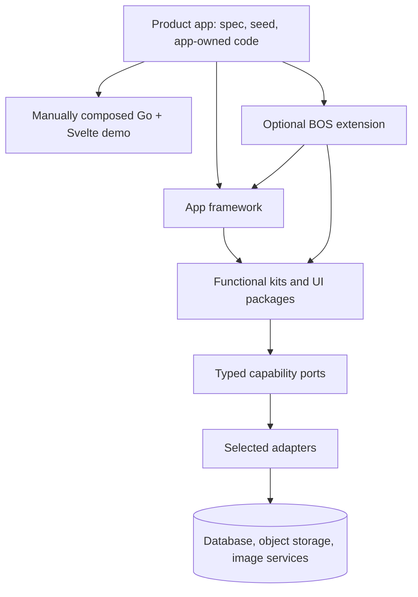

# App framework, BOS extension, and bootstrap/examples

**Date:** 2026-10-07
**Status:** The active scope is completing and accepting the full Hot Potato website port on the
Svelte app framework. Keep the pinned source submodule unchanged. Do not advance to BOS/BR until
the user accepts this port. Bootstrap remains later work, derived from an accepted consumer demo.

Companion reviews:

- [`bos-final-architecture-review.md`](bos-final-architecture-review.md)
- [`bos-pr-2-review.md`](bos-pr-2-review.md)

## 1. The proposed shape

Use a base app framework for reusable application runtime/composition and make BOS an optional
business/admin extension of that framework:

```text
consumer application
  ├── product-owned configuration, routes, domain choices, and overrides
  ├── app framework: runtime composition and platform integration
  ├── optional BOS extension: business admin and editing capabilities
  ├── functional kits: cms, identity, media, real-estate, ...
  └── selected adapters: relational database, content source, blob store, image processor, ...
```

There is one conceptual system but distinct implementation surfaces per platform. Go and Svelte
may expose different APIs, but share the app's module/configuration intent and cross-language data
contracts. Do not force Python into this structure until an actual product needs Python
composition.



## 2. Responsibilities by layer

### Platform packages and functional kits

Packages and kits own capabilities; they do not import a framework or consumer application.

- **UI packages** own reusable Svelte components. CMS/page renderer components and their
  isomorphic schema/types remain separately importable.
- **Content/Markdown packages** own Markdown parsing, transformation, safe rendering, and
  extension hooks. Content loading is separate from Markdown rendering. Untrusted Markdown is
  never treated as trusted HTML; any HTML emission must pass the chosen sanitizer.
- **CMS** owns page/content contracts and a source port. File, API, and database implementations
  produce the same validated page/section representation.
- **Media** owns upload/content metadata and typed ports for bytes and transformations. It does
  not hard-code Cloudflare, local disk, or a particular bucket into page components.
- **SEO, identity, persistence, and domain kits** own their function and their contracts, following
  the current kit taxonomy.

Where a functional kit needs routes, migrations, UI registration, or admin pages, keep that wiring
with the functional kit (the existing D15(b) lean), but have it depend on a small framework-neutral
registration contract. Do not make a low-level package import `app` or `bos` just to register
itself.

### App framework (per platform)

The app framework should provide the shared, reusable mechanism to:

- validate/load the product app spec and assemble enabled modules in declared dependency order;
- establish the request context and the framework-owned middleware order;
- construct per-request services and typed API/BFF clients without shared user-specific module
  state;
- register Svelte client components, layouts, page renderers, fields, and Markdown renderers at
  build time;
- register Go routes, migrations, services, and capability adapters through explicit module
  imports;
- enforce server/client package boundaries and expose normal SvelteKit route stubs where the
  filesystem router requires them;
- validate cross-language contracts and required adapters before the app runs.

The framework supplies an ordered middleware pipeline. Features can contribute documented
middleware with explicit dependency/order constraints, but a product cannot silently reorder or
disable security-critical steps. The Svelte server remains the browser-facing BFF; Go remains the
business API and authoritative layer for domain validation, authorization, and audit.

### BOS extension

BOS depends on the app framework and adds optional business operations:

- admin shell, navigation, breadcrumbs, and admin route composition;
- editable pages/CMS administration and site settings;
- user/role/permission administration, audit views, and resource CRUD as actual use cases require;
- BOS module metadata for permissions, resources, pages, widgets, and navigation;
- Go-side registration/authorization/migration needs for those modules.

The UI may hide controls using permission metadata, but it is never the enforcement point.
Authorization, tenant scope, field filtering, and audit remain server/API responsibilities.
Resource-driven CRUD should be introduced only when repeated real resources justify the contract;
PR #2's `{ id, navItem }` is an early navigation contribution, not that full contract.

## 3. Staged delivery: app framework, BOS/BR, then bootstrap

**Stage 1: Svelte app framework + full Hot Potato port.** Build and validate the full existing
Hot Potato website on a copy of its pinned source, leaving the source submodule unchanged. Preserve
the site's current pages, content, SEO, structured data, and assets while integrating the Svelte app
framework. The app runs on the Node adapter; checked-in content is loaded asynchronously on the
server through a read-only repository, validated against a runtime schema, and registered per
request. Components receive loaded data as props. Keep the repository API small and read-only
because the site has no write use case. The framework owns the schema/repository/registry contracts;
the demo owns its content schema and local data module. Do not add API, database, or other product
behavior that the existing site does not have. Do not implement BOS, Go, BR, or bootstrap during
this stage.

**Stage 2: Go/Svelte frameworks composed by BOS, with BR as the demo consumer.** After Stage 1 is
accepted, extend the app-framework direction across Go and Svelte, compose those frameworks
through BOS, and use BR to exercise the result. This is a consumer-shaped integration demo, not a
bootstrap-generated application. Keep BR-specific data and configuration with BR.

**Later: bootstrap.** Only after the BOS/BR demo is accepted, derive bootstrap from what the
working app and its implementation history actually require. Do not use bootstrap to define the
framework APIs ahead of a working consumer.

The integrated BOS/BR demo is an ordinary consumer-shaped application and deliberately bypasses
bootstrap: this makes it prove what configuration and framework registration really require before
those conventions are templated. After the working demo is accepted, derive bootstrap from its
implementation and scoped change history.

The eventual user-visible convention can be expressed as `framework/{name}/bootstrap` and
`framework/{name}/examples/apps`, while preserving the repository's language-specific framework
layout. This is a future target, not the first implementation tree:

```text
platform/
├── go/
│   └── frameworks/
│       ├── app/
│       │   ├── core/                         # runtime composition contracts
│       │   ├── server/                       # app lifecycle, middleware, routing
│       │   ├── bootstrap/                    # app profile/templates, ordinary starter files
│       │   └── examples/apps/
│       │       └── api-minimal/              # output of the app bootstrap
│       └── bos/
│           ├── server/                       # BOS modules built on the app framework
│           ├── bootstrap/                    # additive BOS profile/extension templates
│           └── examples/apps/
│               └── api-admin/                # output of the BOS profile
└── svelte/
    └── frameworks/
        ├── app/
        │   ├── src/lib/                      # runtime, hooks, registries, integration
        │   ├── bootstrap/                    # SvelteKit app files and route stubs
        │   └── examples/apps/
        │       └── landing/                  # app-only, static/prerendered example
        └── bos/
            ├── src/lib/                      # admin shell and BOS client/server features
            ├── bootstrap/                    # additive BOS routes/configuration
            └── examples/apps/
                └── admin-ui/                 # BOS UI example
projects/
└── demo/
    └── bos-demo/                             # integrated Go + Svelte acceptance consumer
```

This is a target layout, not a request to move current files. The integrated
`projects/demo/bos-demo` stays project-level because it exercises both language frameworks and
the infrastructure bundle. Initially it is composed manually in its Go and Svelte app roots.
Platform-specific examples may live beside their respective framework later.

### Demo-first and later-bootstrap rules

1. **Compose the real app explicitly first.** Go and Svelte each import/register the selected
   platform modules using normal language-native mechanisms and SvelteKit route files.
2. **Use one app configuration.** It declares selected functional components/kits and their
   options; each platform validates and composes its own implementation. It never dynamically
   loads arbitrary code.
3. **Keep the demo generic.** It may exercise the same capabilities and configuration patterns as
   a real consumer, but consumer-specific data, brand, secrets, and exact product configuration
   stay in that consumer's repository.
4. **Keep enough implementation history to derive bootstrap.** Scopes and commits should make
   clear which configuration, Go module, Svelte registration, adapter, route, and service were
   needed. Bootstrap follows the evidence; it does not define the first demo.
5. **Bootstrap writes ordinary app-owned files once.** It must not overwrite consumer changes or
   regenerate the project at runtime. Adding BOS to an existing app must be additive.
6. **Avoid divergent templates and examples.** Once bootstrap is justified, examples may be
   generated from it or checked against it. Do not maintain two competing starter sources.

Bootstrap is a project scaffold, not an SDLC pipeline. The existing rule against building a fully
automated step catalogue still applies.

## 4. App spec and feature registration

Use one authoritative app-level specification for an application. The existing BOS `bos.yaml` can
remain the BOS app's current spec until a separate naming/migration decision; avoid maintaining a
second file with duplicate values. The spec describes selected features/adapters and non-secret configuration. Environment
variables/secret stores supply credentials. Here `components` means selectable application
capabilities or kits (for example, `contacts`), not every individual visual Svelte component;
the chosen capability's Go and Svelte implementations are registered by their own apps.

Illustrative shape only—not an approved schema:

```yaml
name: product
components:
  contacts: {}
  calendar: {}
  real-estate:
    offerings:
      - sale
      - lease
      # Add rental when a future app needs it.
adapters:
  relational: postgres
  cache: redis
  content: database
  blobs: local
  image_processing: local
```

This illustrates the desired composition shape: select functional components and options once;
the schema can admit a future offering without forking the framework. It is not an approved
schema or a named consumer's configuration. Exact consumer settings belong in that consumer's
repo.

The Go and Svelte apps both consume the selected component identities, but explicitly import and
register their respective implementations. Go composes modules, routes, migrations, and services;
Svelte composes matching UI packages, renderers, admin surfaces, and route stubs. The frameworks
validate that both sides satisfy the declared composition. The spec never loads arbitrary code.
Vite may discover framework-owned renderers at build time; consumer additions remain explicit and
type checked.

Feature/module metadata should cover only what composition needs: stable id, required
dependencies/capabilities, configuration schema, registrations, and any migrations or route
needs. Keep the interface small. Add service factories, hooks, components, or admin metadata only
when a concrete feature needs them. This avoids two competing full module systems (`Feature`,
`BosModule`, Go `Module`, and consumer hand wiring) that all claim to be the source of truth.

## 5. Stage 2: per-platform plans and integrated BOS/BR demo

This section describes Stage 2 only; it does not expand the current Stage 1 authorization. Once
Stage 1 is accepted, the Go and Svelte app-framework work should be split by platform and meet at a
cross-platform BOS/BR acceptance gate. The composition is intentionally manual; there is no
bootstrap dependency.

### Go app and BOS Go framework

- Read and validate the shared app configuration.
- Explicitly register the selected Go kits; configuration chooses from compiled/imported modules
  and never dynamically loads a package.
- Compose kit routes, repositories, migrations, authorization/middleware, and jobs through the
  Go app/BOS framework.
- Keep real-estate offering choices in configuration so adding a future offering does not require
  a second implementation or a framework fork.
- Resolve Postgres and Redis connections from environment-backed settings.

### Svelte app and BOS Svelte framework

- Read and validate the same component selection, checking each component has a matching Svelte
  surface or is explicitly API-only.
- Explicitly register UI packages, renderer/layout metadata, admin navigation, and ordinary
  SvelteKit route stubs.
- Keep browser requests same-origin and call typed per-request server services; Go remains
  authoritative for domain validation, business authorization, and audit.
- Keep server-only/client-safe exports distinct. The app runs directly without generated route
  code or a bootstrap.

### Local services and data compatibility

The integrated demo should have a dedicated local Docker stack for Postgres, Redis, and pgAdmin.
Reuse the repository's existing infrastructure service definitions where suitable, and add only
missing reusable service/bundle records. Isolate ports, project names, and persistent dev data
from other local bundles. Keep local credentials in ignored environment files. pgAdmin is for
developer database inspection/debugging; it is not a production dependency or a substitute for
application health/metrics.

The migration acceptance condition is **domain-model/data/SQL compatibility**, not a visual clone.
The target must be able to restore an authorized BR production database dump into an isolated local
BOS database and read the imported data through the selected Go kits. Keep any full production
dump in an approved, access-controlled local location; never commit or attach it to this repository.
Sanitized copies may be used for repeatable development and CI checks. Verify schema constraints
and indexes, row counts, key relationships, representative values across the selected domains, and
application-level reads after the documented migrations/mappings. Never point the demo at or
write into a production system. Where BOS intentionally changes a schema, require a repeatable,
tested migration that preserves the source data's meaning. The attached dump's DDL has now been inspected, but its row data was not read or restored, and the
source submodule/migration history remains unavailable. This is an acceptance requirement, not a
claim of current compatibility.

That schema inspection surfaced compatibility checks for the current Go packages. The generated
transaction mapper omits six persisted sale/lease money columns, but `TransactionService` has
companion `SaveMoney`/`LoadMoney` methods: `Create`/`Update` call the writer, while `Get`/`List` do
not call `LoadMoney`, and it has no callers elsewhere in the package. Normal service reads
therefore do not hydrate those values; the separate write is not shown as atomic with the row
write. Also, `property_units.cover_image_id` has no FK to `images(id)`, and independent
transaction property/unit FKs do not ensure that the unit belongs to the selected property.
Resolve these in the appropriate model/schema scope, or document an explicit decision to enforce
the invariants in application code. They have not been checked against PR #2's exact head.

### Bestays rental and booking composition

The separately supplied Bestays Supabase schema has a small core of
`bestays_properties`, `bestays_property_units`, and `bestays_bookings`. Treat it as evidence for a
second consumer and a bounded porting target, not as a schema to copy wholesale. It is materially
different from the current shared property model: one property `price`, a transaction-type enum,
JSONB location/images/cover image/metadata, and named units. A deliberate mapper/import must
translate those fields to the shared property, location, and media contracts; the legacy enum
contains `sale`, `rent`, `lease`, and `sale-lease`, so the migration must explicitly scope which
records move. No row data was inspected.

The current Go property validator requires `ForSale` or `ForLease`; it cannot currently represent a
rent-only listing. Make listing intent depend on the consumer's enabled offerings, or separate a
neutral physical-property core from offering-specific behavior. Keep the composition split
explicit:

| Consumer | Enabled offerings and domains | Must remain absent unless requested |
|---|---|---|
| BestieRealEstate (BR) | Sale + lease; property and sale/lease transaction features | Rental offering and booking UI/API/actions |
| Bestays | Rent + booking; shared property/contact/content/media foundations only where selected | Sale and lease offering/transaction UI/API/actions |

This is a registration/configuration boundary, not an instruction to fork shared source or expose
every feature in both products. Validate at startup that every selected feature has a compiled
implementation, and test both profiles: disabled offerings must not register routes or admin
actions and must be rejected by write APIs. Do not enable rental for BR until a stakeholder
specifically requests it.

Booking must be a distinct optional domain kit, not merely the future `transaction.TypeRent` facet.
The existing transaction engine records deal terms and closed outcomes; the legacy booking table
represents a dated stay. The DDL checks `end_date > start_date`, but does not prevent overlapping
bookings or ensure a unit belongs to the given property; a nullable `unit_id` also leaves whole-
property versus unit-level conflict semantics unresolved. It has no explicit booking status,
currency, or price basis. Define those domain rules before finalizing the new booking contract.

Do not directly copy the Supabase access layer into plain Postgres. `created_by` references
`auth.users`, policies call `auth.uid()`, and the dump includes Supabase grants, RLS, views,
triggers, functions, and a realtime publication. Map identity to the consumer's selected Go auth
model and re-establish API authorization explicitly. In particular, the schema's anonymous
booking-read policy exposes booking rows for published properties, including guest fields; broad
permissive authenticated policies also mean owner-scoped insert policies do not restrict access.
Public availability must use a safe projection that never returns guest/booking details. Rebuild
views, triggers, and functions against the chosen Postgres schema and test the access boundaries.
This is an architecture/schema review, not a complete security audit.

UI and theme are a separate layer: components may be adapted or the existing theme copied while
the domain structures and SQL remain compatible. Visual parity may be useful, but it does not pass
or replace the dump-restore/data-preservation gate.

## 6. Adapter boundaries

“Storage” should not be modeled as one universal interface. These are distinct responsibilities:

| Capability | Example port | Candidate implementations |
|---|---|---|
| Relational persistence | Go repository/database interfaces | PostgreSQL; Supabase's PostgreSQL-compatible database where the existing SQL/migration behavior fits; a Supabase-specific adapter only when its extra APIs are required |
| CMS/content reads | CMS `ContentSource` | local files, Go API, relational database |
| Blob/object bytes | media `BlobStore` | local filesystem for development, S3-compatible storage/R2, Supabase Storage |
| Image transformation | media `ImageProcessor`/pipeline | local image library, Cloudflare Images/service, worker-backed processing |
| Authentication/identity | identity/auth service interface | current Go auth implementation; a provider-specific adapter only when needed |

`Supabase` is not one interchangeable backend: its Postgres, Auth, and Storage services are
separate provider capabilities. Likewise, Cloudflare Images processing and R2 object storage are
separate choices. A product may use Postgres for business data, R2 for originals, and a Cloudflare
image pipeline for derived/watermarked variants.

For uploads and derived images, keep the product's media behavior behind explicit stages:

```text
upload request → authorize + validate → store original → transform/resize/watermark
              → store variants → return stable metadata/URLs
```

The adapter contract should express the required operations and lifecycle, not a provider's SDK.
For example, an `ImageProcessor` may return variants and metadata while `BlobStore` persists each
object. The app registers both adapters; the media kit composes them. Secrets, signed upload
credentials, size/type limits, retries, and asynchronous worker needs belong in a concrete media
scope informed by a real product, not in this general bootstrap proposal.

## 7. Request and rendering flows

### Public content

```text
browser → SvelteKit app framework → per-request CMS service
        → typed Go API/client or file source
        → CMS contract validation → layout/region resolution → registered Svelte renderer
```

The public route makes an explicit SSR/prerender/cache decision. Static marketing content can use
the file source and be prerendered when the result is identical for every visitor. Dynamic public
content may use the database/API and a public cache only if it is not personalized. The browser
does not receive upstream credentials or internal service URLs.

### Admin/editing

```text
browser → SvelteKit BOS route/action → typed per-request service
        → Go API (validation, authorization, tenant scope, audit)
        → CMS/domain kit → selected adapter
```

SvelteKit's admin UI is a client of the business API, not the authorization authority. Keep
requests same-origin from the browser. A typed BFF service is the default; any generic pass-through
is a deliberate, constrained transport capability.

### Layouts, regions, and Markdown

The layout declares its region names and constraints; the content item declares a renderer/type
and its placement; the renderer declares its data schema. The schema is shared/validated across
Go writes and Svelte reads (generated types or conformance fixtures are an implementation choice
to settle). Markdown parsing/sanitization is a content pipeline, not a storage adapter and not a
layout decision. This retains the constructor's “code declares, data selects” rule while allowing
layout presets and dynamic content.

## 8. Adoption path for product apps

The framework must support two clean choices and one transition:

| Situation | Starting profile | Later change |
|---|---|---|
| Marketing/landing app with no business editing | App framework only: Svelte routes, static/file content, Markdown/renderers, SEO/theme, and prerender/cache rules | Add BOS only when editing/admin workflows are real requirements |
| Product known to need a content/admin surface | BOS profile from the first bootstrap, which includes the app framework | Configure only the modules and adapters the product uses |
| Existing app crosses from published/static content to editing | Add BOS modules/routes and the DB source to the existing app; seed from files once, then DB is authoritative | Do not regenerate the project or keep two live page authorities |

Whether a named product should start in one row or another must be decided in its own repo from its
actual lifecycle, editorial needs, and current architecture. This proposal does not assert that
those product-specific facts have been inspected.

## 9. Agreed sequence of design/implementation scopes

This is a dependency outline. Only the first row is the active implementation scope:

1. **Active — finish and accept the full Hot Potato port:** preserve the existing website's pages,
   content, SEO, structured data, and assets while using the Svelte app framework's runtime schema,
   read-only repository, typed per-request data registry, and server-load integration. Use the Node
   adapter and leave the source submodule unchanged. Do not add API or database behavior. Validate
   with focused tests, Svelte checking, a production build, and a local runtime smoke test; the user
   accepts the site before work moves on.
2. **BOS/BR design and approval:** only after Hot Potato is accepted, confirm the exact Go/Svelte
   framework and BOS/BR scope and its before/after tree. This document is not standing
   implementation authorization.
3. **Go and Svelte app frameworks + BOS/BR demo:** compose selected platform modules manually and
   validate the cross-platform registration and runtime boundary.
4. **Local Docker services:** exercise the BOS/BR demo with isolated Postgres, Redis, and pgAdmin
   using existing infrastructure definitions where possible.
5. **Data compatibility gate:** restore an authorized BR source production dump into the isolated
   local target, run migrations/mappings, and verify data preservation and application behavior.
   Keep the full dump outside Git; use sanitized copies for repeatable checks where possible.
6. **Integrated BOS/BR demo:** prove the configured Go and Svelte components work together from a
   clean setup and repeatable demo seed.
7. **Bootstrap design:** derive templates and checks from the accepted BOS/BR demo and its
   implementation history; do not build bootstrap before the evidence exists.
8. **Product adoption:** review each product in its own repo, select app-only or BOS and its
   component/adapters, then move one vertical slice at a time.

Before any implementation scope, show its exact before/after tree and obtain approval. Each new
definition or repeated process still needs its own user approval. No process-os schema or
bootstrap process is proposed for implementation here.

## 10. Decisions and remaining questions

Agreed for the current slice: the app framework is the base and BOS is an optional extension;
Hot Potato uses Node request-time loading, checked-in content behind a read-only repository, runtime
schema validation, and per-request module registration. Its existing website has no API or database
behavior, and none is added for this port. Other consumers may use API adapters when an actual
consumer requirement defines that later scope.

Still to decide before Stage 2 implementation: the exact shared app configuration contract,
cross-platform module registration surface, first non-local storage adapter, and the BR-specific
data compatibility/migration scope. Resolve those against the Stage 2 consumer and its actual
requirements rather than expanding the Stage 1 framework preemptively.

This document records the current staged direction; it is not standing authorization for future
scopes. Stage 2 and later scopes still require an exact before/after tree and explicit approval.
